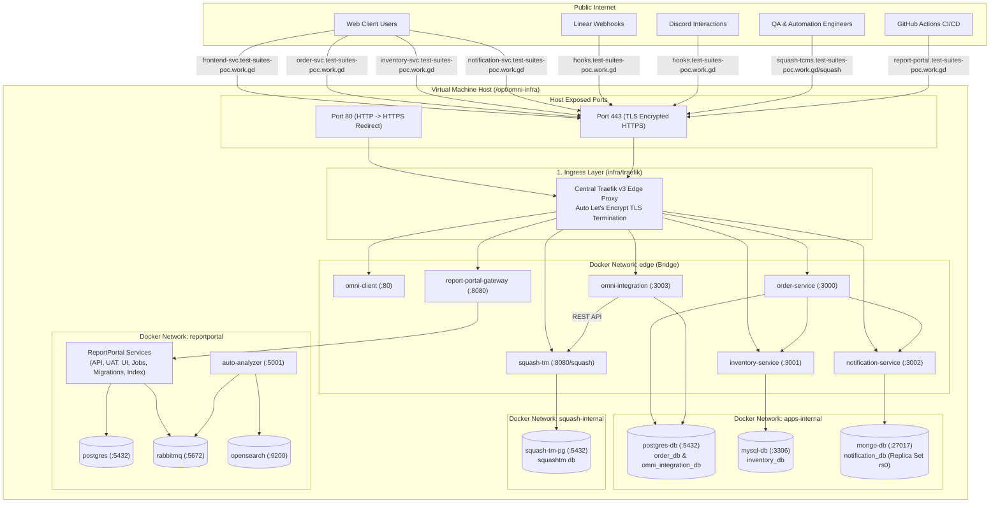

# Omni-Suites Cloud Infrastructure (`infra`)

Unified Docker Compose orchestration and infrastructure-as-code for the **Omni-Suites** platform on the staging virtual machine (`/opt/omni-infra`).

This repository coordinates the central edge reverse proxy, business microservices, test case management (Squash TM), and AI-driven test analytics (ReportPortal) within an isolated, multi-tier network topology.

---

## 🏛️ System Architecture & Global Topology

All incoming traffic enters through a single public ingress point—**Traefik v3**—which terminates TLS certificates automatically via Let's Encrypt and routes traffic to backend containers across an external Docker bridge network named `edge`. Individual stacks operate their own private internal networks to isolate databases and message brokers from public exposure.



---

## 📁 Infrastructure Subsystems

The infrastructure is organized into four independent, decoupled Docker Compose directories:

| Subsystem Directory | Subsystem Documentation | Core Responsibilities |
| :--- | :--- | :--- |
| [`traefik/`](file:///h:/Projects/I_Learn_Cloud/omni-suites/infra/traefik/README.md) | [Traefik Edge Proxy Documentation](file:///h:/Projects/I_Learn_Cloud/omni-suites/infra/traefik/README.md) | Central ingress, automatic Let's Encrypt TLS certificate generation, HTTP-to-HTTPS redirection, and domain routing rules. Creates the shared `edge` Docker network. |
| [`apps/`](file:///h:/Projects/I_Learn_Cloud/omni-suites/infra/apps/README.md) | [Application Stack Documentation](file:///h:/Projects/I_Learn_Cloud/omni-suites/infra/apps/README.md) | Business microservices (`order`, `inventory`, `notification`), frontend web application (`omni-client`), integration service (`omni-integration`), and their isolated databases (PostgreSQL 15, MySQL 8, MongoDB 6 replica set). |
| [`squash-tm/`](file:///h:/Projects/I_Learn_Cloud/omni-suites/infra/squash-tm/README.md) | [Squash TM Documentation](file:///h:/Projects/I_Learn_Cloud/omni-suites/infra/squash-tm/README.md) | Test case management system (TM/TCMS) and dedicated PostgreSQL database. Synchronizes test cases from Linear issue webhooks and tracks manual/automated QA campaigns. |
| [`report-portal/`](file:///h:/Projects/I_Learn_Cloud/omni-suites/infra/report-portal/README.md) | [ReportPortal Documentation](file:///h:/Projects/I_Learn_Cloud/omni-suites/infra/report-portal/README.md) | AI-powered test automation analytics dashboard (ReportPortal v5.15) running 12 containers including PostgreSQL 18, RabbitMQ, OpenSearch, Spring Boot API, and Python auto-analyzer. |

---

## 🌐 Master Routing & DNS Directory

All public hostnames are registered under the domain zone `test-suites-poc.work.gd` and resolved by the central Traefik proxy as defined in [`traefik/dynamic/routes.yml`](file:///h:/Projects/I_Learn_Cloud/omni-suites/infra/traefik/dynamic/routes.yml):

| Service | Public HTTPS URL | Backend Container | Port / Context | Stack Directory |
| :--- | :--- | :--- | :--- | :--- |
| **Frontend Web App** | `https://frontend-svc.test-suites-poc.work.gd` | `omni-client` | `80` | `apps/` |
| **Order Microservice** | `https://order-svc.test-suites-poc.work.gd` | `order-service` | `3000` | `apps/` |
| **Inventory Microservice** | `https://inventory-svc.test-suites-poc.work.gd` | `inventory-service` | `3001` | `apps/` |
| **Notification Microservice** | `https://notification-svc.test-suites-poc.work.gd` | `notification-service` | `3002` | `apps/` |
| **Omni Integration (Webhooks)** | `https://hooks.test-suites-poc.work.gd` | `omni-integration` | `3003` | `apps/` |
| **Squash TM (Test Management)** | `https://squash-tcms.test-suites-poc.work.gd/squash` | `squash-tm` | `8080` (path `/squash`) | `squash-tm/` |
| **ReportPortal (Test Analytics)**| `https://report-portal.test-suites-poc.work.gd` | `report-portal-gateway`| `8080` | `report-portal/` |

---

## 🚀 Virtual Machine Bring-Up Guide

### Host Machine Prerequisites
* **Operating System:** Linux (Ubuntu 22.04 LTS or Debian 12 recommended)
* **Compute Capacity:** Minimum 4 vCPU, 16 GB RAM (ReportPortal + OpenSearch + Java stacks require adequate headroom)
* **Storage:** Minimum 50 GB SSD
* **Installed Tooling:**
  * Docker Engine (>= 24.0) & Docker Compose (>= v2.20)
  * Google Cloud CLI (`gcloud`) with Artifact Registry Docker credentials configured:
    ```bash
    gcloud auth configure-docker us-central1-docker.pkg.dev
    ```
* **Firewall Rules:**
  * Inbound Port `22` (SSH)
  * Inbound Port `80` (HTTP - required for Let's Encrypt validation & HTTPS redirects)
  * Inbound Port `443` (HTTPS - all web & API traffic)
  * *All internal database and service ports must remain closed to the public internet.*

---

### Step-by-Step Startup Sequence

> [!IMPORTANT]
> **Strict Dependency:** The `traefik` stack **must always be started first**. It creates the external Docker network named `edge`. If any other stack is launched before Traefik, Docker Compose will fail with: `network edge not found`.

#### 1. Start Central Ingress (Traefik)
```bash
cd /opt/omni-infra/traefik
cp .env.sample .env
# Edit .env and ensure ACME_EMAIL is set
docker compose up -d
```
*(Creates the `edge` network and opens ports 80 and 443).*

#### 2. Start Omni Applications & Databases Stack
```bash
cd /opt/omni-infra/apps
cp .env.sample .env
# Fill in GCP_AR_REPO, database passwords, Linear/Discord keys
docker compose pull
docker compose up -d
```
*(Initializes PostgreSQL, MySQL, MongoDB replica set `rs0`, and starts all 5 microservices).*

#### 3. Start Squash TM Stack
```bash
cd /opt/omni-infra/squash-tm
cp .env.sample .env
# Fill in database credentials and SQUASH_REST_API_JWT_SECRET (openssl rand -base64 64)
docker compose pull
docker compose up -d
```

#### 4. Start ReportPortal Stack
```bash
cd /opt/omni-infra/report-portal
cp .env.sample .env
# Fill in PostgreSQL, RabbitMQ, and RP_INITIAL_ADMIN_PASSWORD
docker compose pull
docker compose up -d
```

---

## 🔄 Global Stack Operations

### Check Health of All Stacks
To inspect all running containers and their health statuses across the virtual machine:
```bash
docker ps --format "table {{.Names}}\t{{.Status}}\t{{.Ports}}\t{{.Networks}}"
```

### Stopping All Services Safely
When performing host maintenance or reboots, gracefully bring down the stacks:
```bash
cd /opt/omni-infra/report-portal && docker compose down
cd /opt/omni-infra/squash-tm     && docker compose down
cd /opt/omni-infra/apps          && docker compose down
cd /opt/omni-infra/traefik        && docker compose down
```

### Restarting a Specific Service (CI/CD Deployment)
For automated staging deployments triggered by GitHub Actions runners, update only the target service without disrupting sibling containers:
```bash
# Example: Deploying an updated order-service
cd /opt/omni-infra/apps
docker compose pull order-service
docker compose up -d --no-deps order-service
```

---

## 🔒 Security Architecture

1. **Zero Public Database Exposure:**
   None of the persistence layers (`postgres-db`, `mysql-db`, `mongo-db`, `squash-tm-pg`, `postgres` for ReportPortal, `rabbitmq`, or `opensearch`) expose host ports. They exist solely on private Docker bridge networks (`apps-internal`, `squash-internal`, `reportportal`).
2. **Encrypted Ingress with Automatic Renewals:**
   Traefik manages automated Let's Encrypt certificates using HTTP-01 ACME challenges over port `80`. Certificates are securely persisted in the `letsencrypt` Docker volume (`/letsencrypt/acme.json`).
3. **Webhook Verification:**
   All public webhooks exposed through `omni-integration` require signature validation (`LINEAR_WEBHOOK_SECRET` for Linear, Ed25519 public key verification for Discord interaction events).
4. **Credential Isolation:**
   Each stack utilizes its own gitignored `.env` file with restrictive file permissions (`chmod 600 .env`).
