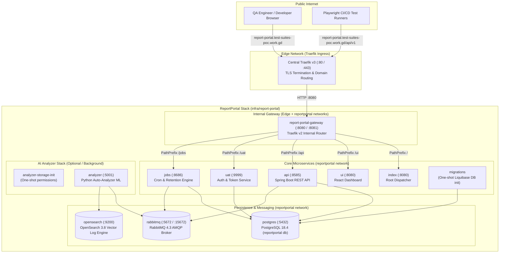

# ReportPortal Infrastructure Stack (`infra/report-portal`)

Docker Compose orchestration for **ReportPortal v5.15** (Enterprise Test Automation Dashboard & AI-powered Analytics) on the staging virtual machine. ReportPortal aggregates test results, logs, and artifacts from **Omni-Suites Playwright E2E**, **API test suites**, and performance runs into unified dashboards with automatic defect categorization.

---

## 🏗️ Architecture & Network Topology

ReportPortal is built on a distributed microservices architecture coordinated by an internal Traefik gateway, operating behind the central VM-level [Traefik Edge Reverse Proxy](../traefik).

### Dual-Proxy Ingress Flow:
1. **Central Traefik v3 (`infra/traefik`)**: Listens on public ports `80`/`443`, terminates Let's Encrypt TLS, and forwards traffic for `report-portal.test-suites-poc.work.gd` across the Docker `edge` network to `report-portal-gateway:8080`.
2. **Internal Traefik v2 (`report-portal-gateway`)**: Dispatches incoming requests across the isolated `reportportal` bridge network using Docker container labels:
   * `/ui` → `ui` (Web Frontend :8080)
   * `/api` → `api` (REST API Backend :8585)
   * `/uat` → `uat` (User Authorization & OAuth2 :9999)
   * `/jobs` → `jobs` (Background Scheduled Tasks :8686)
   * `/` → `index` (Root Redirector & Index Service :8080)



---

## 📦 Service Inventory & Specifications

| Service | Container Name | Image | Internal Port | Profiles | Networks | Persistent Volumes | Description & Responsibilities |
| :--- | :--- | :--- | :--- | :--- | :--- | :--- | :--- |
| **`gateway`** | `report-portal-gateway` | `traefik:v2.11.54` | `8080` (HTTP), `8081` (Admin) | `core`, `infra`, `default` | `reportportal`, `edge` | Docker socket (`/var/run/docker.sock`) | Internal reverse proxy auto-discovering ReportPortal microservices via Docker labels. |
| **`postgres`** | `postgres` | `postgres:18.4` | `5432` | `core`, `infra`, `default` | `reportportal` | `postgres` (`/var/lib/postgresql`) | Primary relational database storing project metadata, user accounts, and test launch histories. |
| **`rabbitmq`** | `rabbitmq` | `rabbitmq:4.3.4-management` | `5672` (AMQP), `15672` (UI) | `core`, `infra`, `default` | `reportportal` | Docker configs (`99-extra.conf`, `enabled_plugins`) | High-performance message broker coordinating asynchronous log ingestion and ML analyzer queues. |
| **`opensearch`** | `opensearch` | `opensearchproject/opensearch:3.8.0` | `9200`, `9600` | `default` | `reportportal` | `opensearch` (`/usr/share/opensearch/data`) | Full-text search and vector indexing store powering log analysis and pattern detection. |
| **`migrations`** | `migrations` | `reportportal/migrations:5.15.4` | — | `core`, `infra`, `default` | `reportportal` | — | One-shot migration runner executing Liquibase database updates on PostgreSQL before services start. |
| **`index`** | `index` | `reportportal/service-index:5.15.1` | `8080` | `core`, `infra`, `default` | `reportportal` | — | Root landing router redirecting web users to `/ui`. |
| **`ui`** | `ui` | `reportportal/service-ui:5.15.5` | `8080` | `core`, `default` | `reportportal` | — | React SPA frontend delivering interactive dashboards, test drill-downs, and analytics widgets. |
| **`api`** | `api` | `reportportal/service-api:5.15.4` | `8585` | `core`, `default` | `reportportal` | `storage` (`/data/storage`) | Core Spring Boot REST API for reporting launches, test suites, steps, logs, and screenshots. |
| **`uat`** | `uat` | `reportportal/service-authorization:5.15.1` | `9999` | `core`, `default` | `reportportal` | `storage` (`/data/storage`) | User Authorization & Token service (OAuth2 / JWT). Bootstraps the initial superadmin account. |
| **`jobs`** | `jobs` | `reportportal/service-jobs:5.15.2` | `8686` | `core`, `default` | `reportportal` | `storage` (`/data/storage`) | Scheduled background job runner for data retention cleanup, attachment expiration, and metrics. |
| **`analyzer-storage-init`** | `analyzer-storage-init` | `busybox:1.38.0` | — | `analyzer`, `default` | `none` | `analyzer-storage` (`/data`) | One-shot rootless permissions initializer ensuring UID/GID `65532:65532` for Analyzer storage. |
| **`analyzer`** | `analyzer` | `reportportal/service-auto-analyzer:5.15.5` | `5001` | `analyzer`, `default` | `reportportal` | `analyzer-storage` (`/data/storage/analyzer`) | Python ML auto-analyzer automatically clustering and predicting failure root causes. |

---

## 🌐 Ingress & Routing (Traefik)

Configured externally in [`../traefik/dynamic/routes.yml`](../traefik/dynamic/routes.yml):

| Configuration | Value | Notes |
| :--- | :--- | :--- |
| **Public Hostname** | `https://report-portal.test-suites-poc.work.gd` | Terminated with Let's Encrypt TLS by central Traefik. |
| **Backend Target** | `http://report-portal-gateway:8080` | Communicates over the external `edge` network. |
| **Internal Path Rewrites** | Handled by `report-portal-gateway` | Subpaths (`/ui`, `/api`, `/uat`, `/jobs`) are stripped and forwarded to their respective microservices. |
| **Reporting API URL** | `https://report-portal.test-suites-poc.work.gd/api/v1` | Target endpoint for test runners and reporter agents. |

---

## ⚙️ Environment Configuration (`.env`)

Copy the configuration template to initialize your environment:
```bash
cp .env.sample .env
```

### Complete Configuration Reference

| Variable | Required | Default / Example | Purpose |
| :--- | :---: | :--- | :--- |
| `POSTGRES_USER` | **Yes** | `rpuser` | Superuser for ReportPortal PostgreSQL instance. |
| `POSTGRES_PASSWORD` | **Yes** | `change-me-rp-db` | Database password. |
| `POSTGRES_DB` | **Yes** | `reportportal` | Database schema name initialized on first boot. |
| `RABBITMQ_DEFAULT_USER` | **Yes** | `rabbitmq` | Username for RabbitMQ AMQP broker. |
| `RABBITMQ_DEFAULT_PASS` | **Yes** | `change-me-rabbitmq` | Password for RabbitMQ AMQP broker. |
| `RP_INITIAL_ADMIN_PASSWORD` | **Yes** | `erebus` | **Initial password** for the default `superadmin` account on first boot. |
| `MIGRATIONS_IMAGE` | No | `reportportal/migrations:5.15.4` | Optional Docker image override for database migrations. |
| `INDEX_IMAGE` | No | `reportportal/service-index:5.15.1` | Optional Docker image override for index service. |
| `UI_IMAGE` | No | `reportportal/service-ui:5.15.5` | Optional Docker image override for Web UI. |
| `API_IMAGE` | No | `reportportal/service-api:5.15.4` | Optional Docker image override for REST API backend. |
| `UAT_IMAGE` | No | `reportportal/service-authorization:5.15.1` | Optional Docker image override for Auth service. |
| `JOBS_IMAGE` | No | `reportportal/service-jobs:5.15.2` | Optional Docker image override for Jobs service. |
| `ANALYZER_IMAGE` | No | `reportportal/service-auto-analyzer:5.15.5` | Optional Docker image override for Auto-Analyzer. |

---

## 🚀 Operations & Deployment Guide

### Prerequisites
1. **Central Traefik Proxy Running**:
   The `edge` network must exist before launching:
   ```bash
   cd /opt/omni-infra/traefik && docker compose up -d
   ```
2. **Sufficient System Memory**:
   ReportPortal runs multiple Java Spring Boot services and OpenSearch. Ensure the host VM has at least **4 GB to 8 GB of free RAM**.

### Starting the Stack

```bash
cd /opt/omni-infra/report-portal

# 1. Pull the official images
docker compose pull

# 2. Start the stack in detached mode
docker compose up -d

# 3. Check startup progression
docker compose ps
```

> [!NOTE]
> **Warm-Up Duration:** Upon first startup, the `migrations` service applies database schemas, followed by Java Spring Boot initialization for `api` and `uat`. Complete startup typically takes **60 to 90 seconds**. Traefik will return `502 Bad Gateway` until `api`, `uat`, and `ui` pass their internal healthchecks.

### Monitoring Logs

```bash
# Monitor core API backend logs
docker compose logs -f api

# Monitor Auth (UAT) logs
docker compose logs -f uat

# Monitor RabbitMQ broker
docker compose logs -f rabbitmq

# Monitor Auto-Analyzer logs
docker compose logs -f analyzer
```

### Stopping the Stack

```bash
# Stop all services (preserves persistent test data, databases, and logs)
docker compose down

# Stop and purge all data volumes (WARNING: Deletes all launches, projects, and users)
docker compose down -v
```

---

## 🔑 Initial Configuration & Playwright Setup

### 1. Default SuperAdmin Login
Navigate to `https://report-portal.test-suites-poc.work.gd`:
* **Username:** `superadmin`
* **Password:** Value of `RP_INITIAL_ADMIN_PASSWORD` (default: `erebus`)

> [!IMPORTANT]
> Immediately change the `superadmin` password upon first login by clicking the user avatar in the top right → **Profile** → **Change password**.

### 2. Create the Omni-Suites Project
1. Open the left menu and select **Administrative** → **Projects**.
2. Click **+ Add New Project**.
3. Name the project **`omni-suites`** (in lowercase).
4. Assign team members or test runner accounts as required.

### 3. Generate an API Key for Automated Test Runners
1. Click the user profile icon (top right) → **Profile**.
2. Navigate to the **API Keys** tab.
3. Click **+ Generate API Key**:
   * **Key Name:** `playwright-e2e-runner`
4. Copy the generated key token immediately (it cannot be retrieved again).

### 4. Link with `test-suites`
In `/opt/omni-infra/test-suites/.env` (or your local [`test-suites/.env`](file:///h:/Projects/I_Learn_Cloud/omni-suites/test-suites/.env)):

```bash
RP_ENABLED=true
RP_ENDPOINT=https://report-portal.test-suites-poc.work.gd/api/v1
RP_PROJECT=omni-suites
RP_LAUNCH=playwright-e2e
RP_DESCRIPTION=Omni-Suites Automated E2E & API Test Run
RP_API_KEY=<your_generated_api_key>
```

When Playwright tests run (`npx playwright test`), results, error logs, and execution traces will stream directly to ReportPortal under the **omni-suites** project dashboard.

---

## 💾 Storage & Data Persistence

* **`postgres`**: Relational database storage (`postgres` named volume) storing test metadata, launches, accounts, and test run hierarchy.
* **`opensearch`**: Search and log vector storage (`opensearch` named volume) for text indexing and auto-analysis.
* **`storage`**: Shared binary storage volume mounted to `/data/storage` across `api`, `uat`, and `jobs` for screenshots, artifacts, and user uploads.
* **`analyzer-storage`**: Dedicated volume (`/data/storage/analyzer`) for ML models and training weights.

### Backup Database
```bash
docker exec -t postgres pg_dump -U rpuser reportportal | gzip > reportportal_backup_$(date +%Y%m%d_%H%M%S).sql.gz
```

### Restore Database
```bash
gunzip < reportportal_backup_YYYYMMDD_HHMMSS.sql.gz | docker exec -i postgres psql -U rpuser -d reportportal
```

---

## 🔍 Troubleshooting & Diagnostics

| Symptom | Root Cause | Resolution |
| :--- | :--- | :--- |
| **`502 Bad Gateway` from Traefik** | `api`, `uat`, or `ui` still booting or warming up. | Monitor logs via `docker compose logs -f api uat`. Wait until healthchecks pass (`docker compose ps`). |
| **`Connection refused` on PostgreSQL** | Database container not ready or initialization error. | Verify PostgreSQL healthcheck with `docker compose logs postgres`. Ensure shared memory (`shm_size: '512m'`) is sufficient. |
| **RabbitMQ disk alarm blocking messages** | Free disk space on the Docker volume fell below 50MB. | Check available disk space (`df -h`). Purge stale Docker containers/images (`docker system prune -f`). |
| **OpenSearch exits with error code 137 (OOM)** | Insufficient memory allocated or `vm.max_map_count` is too low. | Increase kernel virtual memory on host: `sudo sysctl -w vm.max_map_count=262144`. |
| **Playwright tests report `401 Unauthorized`** | Expired or incorrect `RP_API_KEY`. | Regenerate the API key under ReportPortal Profile → API Keys and update `test-suites/.env`. |
| **Playwright tests report `404 Not Found`** | Incorrect `RP_ENDPOINT` or `RP_PROJECT`. | Verify `RP_ENDPOINT` ends with `/api/v1` (e.g. `https://report-portal.test-suites-poc.work.gd/api/v1`) and project name matches exactly in lowercase (`omni-suites`). |
