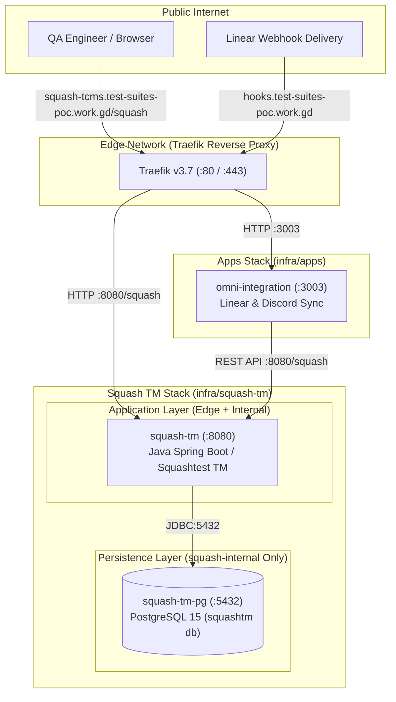

# Squash TM Infrastructure Stack (`infra/squash-tm`)

Docker Compose orchestration for **Squash TM** (Test Management System) and its dedicated PostgreSQL 15 database on the staging virtual machine. This stack provides centralized test case authoring, campaign execution, and automated test synchronization with **Linear** and **Omni-Suites Playwright / API test suites**.

---

## 🏗️ Architecture & Network Topology

Squash TM is deployed as a multi-container stack with network isolation:
1. **`edge` (External)**: Shared with the central [Traefik Edge Proxy](../traefik) and [`infra/apps`](../apps). Traefik terminates TLS and routes public HTTPS traffic to the `squash-tm` web UI (`/squash`). Additionally, `omni-integration` communicates directly with `squash-tm:8080/squash` across this network.
2. **`squash-internal` (Private)**: Dedicated internal Docker bridge isolating the backend database (`squash-tm-pg`) from external networks and Traefik.



---

## 📦 Service Inventory & Specifications

| Service | Container Name | Image | Internal Port | Networks | Data Volume | Description & Health Check |
| :--- | :--- | :--- | :--- | :--- | :--- | :--- |
| **`squash-tm-pg`** | `squash-tm-pg` | `postgres:15` | `5432` | `squash-internal` | `squash-tm-pg-data` (`/var/lib/postgresql/data`) | Dedicated PostgreSQL 15 database storing test cases, executions, and requirements. |
| **`squash-tm`** | `squash-tm` | `squashtest/squash` | `8080` (context: `/squash`) | `squash-internal`, `edge` | `squash-tm-logs` (`/opt/squash-tm/logs`) | Official Squash TM application server running Java Spring Boot. Communicates with `squash-tm-pg` over JDBC. |

---

## 🌐 Ingress & Routing (Traefik)

The public hostname routing is configured in [`../traefik/dynamic/routes.yml`](../traefik/dynamic/routes.yml):

| Configuration | Value | Notes |
| :--- | :--- | :--- |
| **Public Hostname** | `https://squash-tcms.test-suites-poc.work.gd/squash` | Enforces HTTPS via Traefik `https-redirect` middleware. |
| **Application Context Path** | `/squash` | **Crucial:** Squash TM serves its UI and REST API under the `/squash` subpath. Root requests (`/`) will return a 404 or redirect. |
| **Target Container** | `http://squash-tm:8080` | Connected over the external `edge` network. |
| **Internal Docker URL** | `http://squash-tm:8080/squash` | Used by `omni-integration` in [`../apps/.env`](../apps/.env.sample) (`SQUASH_BASE_URL`). |

---

## ⚙️ Environment Configuration (`.env`)

Create your `.env` configuration file from the template:
```bash
cp .env.sample .env
```

### Configuration Variables

| Variable | Required | Default / Example | Purpose |
| :--- | :---: | :--- | :--- |
| `DB_USERNAME` | **Yes** | `squashtm` | PostgreSQL database user for Squash TM. |
| `DB_PASSWORD` | **Yes** | `change-me-squash-db` | PostgreSQL password for the database user. |
| `DB_DATABASE` | **Yes** | `squashtm` | Database schema name initialized on PostgreSQL boot. |
| `DB_TYPE` | **Yes** | `postgresql` | Database driver profile for Spring Boot (`postgresql`). |
| `DB_HOST` | **Yes** | `squash-tm-pg` | Container hostname of the database on `squash-internal`. |
| `DB_PORT` | **Yes** | `5432` | PostgreSQL listener port. |
| `SQUASH_REST_API_JWT_SECRET` | **Yes** | *(64-byte base64 string)* | **Mandatory** for Personal Access Token (PAT) generation and REST API authentication (min 512 bits / 64 bytes). |

### Generating `SQUASH_REST_API_JWT_SECRET`

Squash TM requires a high-entropy secret (at least 512 bits / 64 bytes base64-encoded) to sign JWT authentication tokens. Generate one using OpenSSL:

```bash
openssl rand -base64 64
```
Paste the generated output into `.env` for `SQUASH_REST_API_JWT_SECRET`.

---

## 🚀 Operations & Deployment Guide

### Prerequisites
1. **Traefik must be up**: The external `edge` network must already exist:
   ```bash
   cd /opt/omni-infra/traefik && docker compose up -d
   ```

### Starting the Stack

```bash
cd /opt/omni-infra/squash-tm

# 1. Pull the official images
docker compose pull

# 2. Start the database and application
docker compose up -d

# 3. Monitor startup logs
docker compose logs -f squash-tm
```

> [!NOTE]
> **Warmup Duration:** Squash TM is a large Java Spring Boot enterprise application. On initial boot, database schema migrations (Liquibase) and bean initialization can take between **45 to 90 seconds** before the server begins responding on port `8080`. Traefik may return a `502 Bad Gateway` until the Spring application context has fully initialized.

### Inspecting Service Status

```bash
# Check container status
docker compose ps

# View database logs
docker compose logs -f squash-tm-pg

# View Squash TM application logs
docker compose logs -f squash-tm
```

### Stopping the Stack

```bash
# Stop containers (preserves database and log volumes)
docker compose down

# Stop and remove volumes (WARNING: Destroys all test cases and execution history)
docker compose down -v
```

---

## 🔑 Post-Installation & Initial Configuration

Once the service is accessible at `https://squash-tcms.test-suites-poc.work.gd/squash`:

### 1. Default Administrator Credentials
* **Username:** `admin`
* **Password:** `admin`

> [!IMPORTANT]
> Change the default administrator password immediately upon your first login under **Administration** → **Users** → **admin**.

### 2. Create the Omni-Suites Project
For the Linear webhook integration to synchronize test cases automatically, the target project must exist:
1. Navigate to **Administration** (gear icon) → **Projects**.
2. Click **+ Add Project**.
3. Name the project **`omni-suites`** (must match `SQUASH_PROJECT_NAME` in `infra/apps/.env`).
4. Set description and permissions as appropriate, then save.

### 3. Generate Personal Access Token (PAT) for Integrations
1. Click on the user profile menu in the upper-right corner → **My account**.
2. Select the **API Tokens** tab.
3. Click **+ Add token**:
   * **Name:** `omni-integration-staging`
   * **Scope:** Read & Write
   * **Expiration:** Set desired expiration date
4. Copy the generated bearer token.
5. In `/opt/omni-infra/apps/.env`, set:
   ```bash
   SQUASH_API_TOKEN=<generated_jwt_token>
   ```
6. Restart `omni-integration`:
   ```bash
   cd /opt/omni-infra/apps && docker compose up -d --force-recreate omni-integration
   ```

---

## 🔄 Integration with Omni-Suites Ecosystem

### 1. Linear Ticket Synchronization (`omni-integration`)
When an issue in Linear is labeled with `ready-for-tc`:
- Linear dispatches a webhook to `https://hooks.test-suites-poc.work.gd/webhooks/linear`.
- `omni-integration` calls Squash TM's REST API at `http://squash-tm:8080/squash/api/rest/latest/...`.
- A structured test case is created in Squash TM with preconditions, steps, and expected results parsed from the Linear issue body.
- The mapping between Linear issue ID and Squash Test Case ID is idempotently persisted in `omni_integration_db`.

### 2. Automated Test Suite Sync (`test-suites`)
- Playwright E2E and API tests tag test cases with the Squash Test Case ID (e.g. `TC-106`).
- Test execution results can be reported back into Squash TM execution campaigns via the [`test-suites/src/reporters/squash-sync.ts`](file:///h:/Projects/I_Learn_Cloud/omni-suites/test-suites/src/reporters/squash-sync.ts) adapter.

---

## 🔍 Troubleshooting & Diagnostics

| Symptom | Root Cause | Resolution |
| :--- | :--- | :--- |
| **`502 Bad Gateway` on browser load** | Spring Boot container is still warming up, or database schema migration is in progress. | Check container logs: `docker compose logs -f squash-tm`. Wait until you see `Started SquashApplication in X seconds`. |
| **`404 Not Found` when opening hostname** | Accessed the domain root (`/`) rather than the application context path (`/squash`). | Navigate explicitly to `https://squash-tcms.test-suites-poc.work.gd/squash`. |
| **`network edge not found` during compose up** | Central Traefik proxy is not started. | Run `cd /opt/omni-infra/traefik && docker compose up -d` before starting Squash TM. |
| **API token generation disabled or fails** | `SQUASH_REST_API_JWT_SECRET` is missing or shorter than 512 bits. | Generate a 64-byte base64 secret (`openssl rand -base64 64`), set in `.env`, and restart `squash-tm`. |
| **Database connection refused (`Connection to squash-tm-pg:5432 refused`)** | `squash-tm-pg` has not initialized or failed to start. | Inspect database logs with `docker compose logs squash-tm-pg`. Verify credentials in `.env` match `DB_USERNAME` and `DB_PASSWORD`. |

---

## 💾 Backup & Data Persistence

* **PostgreSQL Data Volume:** Stored in Docker named volume `squash-tm-pg-data`.
* **Application Logs:** Stored in Docker named volume `squash-tm-logs` (`/opt/squash-tm/logs`).

### Creating a Database Backup
```bash
# Dump the squashtm database to a local file
docker exec -t squash-tm-pg pg_dump -U squashtm squashtm | gzip > squash_backup_$(date +%Y%m%d_%H%M%S).sql.gz
```

### Restoring a Database Backup
```bash
# Decompress and restore dump
gunzip < squash_backup_YYYYMMDD_HHMMSS.sql.gz | docker exec -i squash-tm-pg psql -U squashtm -d squashtm
```
